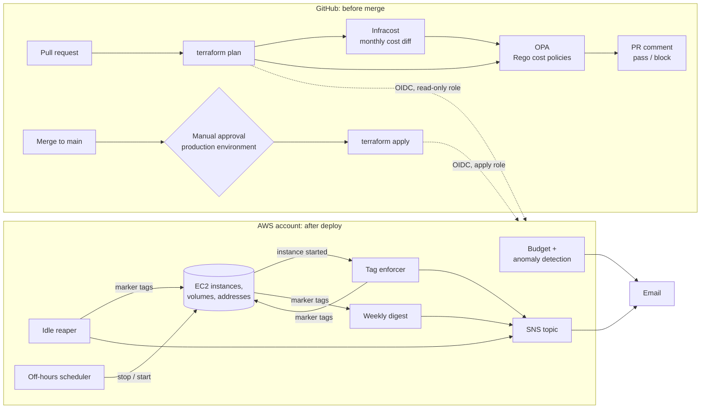

# finops-guardrails

Cost guardrails for AWS, built with Terraform. It stops cloud waste at two points:

- **Before merge.** A GitHub Actions bot ("CostGuard") plans every Terraform pull request, prices the change, checks it against cost policies written in Rego, comments the result on the PR, and blocks the merge on violations.
- **After deploy.** Budget and anomaly alerts, plus Lambda functions that find idle and untagged resources in the account, switch off development servers outside working hours, and send a summary of spend and open findings.

It runs for well under $1 a month, and GitHub deploys it to AWS with no stored access keys.

## See it work

[Pull request #1](https://github.com/Arush5024/finops-guardrails/pull/1) changes a deliberately wasteful stack. CostGuard blocked it and commented:

> ## CostGuard: `examples/wasteful-stack`
>
> ❌ **Blocked** — fix the violations below before merging.
>
> | Monthly cost | Before | After | Change |
> |---|---:|---:|---:|
> | **Total** | $0.00 | $868.18 | **+$868.18** |
>
> **Violations (14)** — `aws_ebs_volume.scratch` uses gp2; use gp3 · `aws_instance.app` is missing required tags: Owner, Environment, CostCenter · `aws_cloudwatch_log_group.app` never expires logs · Total cost would be $868.18/month, above the $100/month hard cap · …
>
> **Needs approval (5)** — `aws_instance.app` uses instance type m5.2xlarge, which is outside the approved list · `aws_nat_gateway.main` adds a NAT gateway (about $40/month before data charges) · …

The project's own infrastructure goes through the same check: see pull requests [#2](https://github.com/Arush5024/finops-guardrails/pull/2) and [#3](https://github.com/Arush5024/finops-guardrails/pull/3), which the bot passed before they were deployed.

## Architecture



## What the bot checks

| Rule | Result | Why |
|---|---|---|
| Missing `Owner`, `Environment` or `CostCenter` tag | Blocks | Untagged spend cannot be attributed to anyone |
| gp2 storage on EBS, EC2 or RDS | Blocks | gp3 is cheaper and faster |
| CloudWatch log group with no retention | Blocks | Logs kept forever grow the bill forever |
| Total monthly cost above the hard cap | Blocks | Budget limit |
| Instance type or DB class outside the approved list | Needs approval | Someone should decide it is worth it |
| Multi-AZ database outside production | Needs approval | Doubles the instance cost |
| New NAT gateway | Needs approval | About $40/month before any traffic |
| Monthly cost increase above the threshold | Needs approval | Large changes deserve a second look |

"Needs approval" findings fail the check until a reviewer adds the `cost-approved` label to the PR. "Blocks" findings cannot be overridden. Thresholds and allow-lists live in [policies/data.json](policies/data.json).

## What the runtime guardrails do

| Guardrail | Trigger | Finds | Action |
|---|---|---|---|
| Idle reaper | Daily | Unattached volumes, unassociated Elastic IPs, instances whose CPU never passes 5% in 72 hours | Tags the resource `finops:idle-since`, emails a report with an estimated monthly waste, stops an instance still idle after 3 days |
| Tag enforcer | The moment an instance starts running, plus a daily sweep | Instances and unattached volumes missing `Owner`, `Environment` or `CostCenter` | Tags the resource `finops:untagged-since`, emails a report, stops an instance still untagged after 24 hours |
| Off-hours scheduler | 20:00 and 08:00 on weekdays (Asia/Kolkata) | Instances tagged `Schedule = office-hours` | Stops them in the evening, starts the ones it stopped in the morning |
| Weekly digest | Mondays, when `weekly_digest_enabled = true`; otherwise on demand | Spend for the last 7 days against the 7 before, month to date against the budget, and everything still flagged | Emails one summary. Read-only. |

Safety rules for the three that act on resources:

- They never delete or terminate anything. Their IAM roles do not allow it.
- They run in dry-run mode by default: findings are reported, nothing is stopped. Set `guardrails_dry_run = false` to enforce.
- A resource tagged `finops:exempt = true` is ignored.

To send a digest on demand:

```bash
aws lambda invoke --function-name finops-guardrails-weekly-digest --payload "{}" --cli-binary-format raw-in-base64-out digest.json
```

## Results

| What | Result |
|---|---|
| Wasteful demo stack ([PR #1](https://github.com/Arush5024/finops-guardrails/pull/1)) | Blocked: $868.18/month, 14 violations, 5 findings needing approval |
| Untagged `t4g.nano` launched in a live account | Flagged by the tag enforcer about 6 seconds after launch, and reported by email |
| Unassociated Elastic IP in a live account | Flagged by the idle reaper with a $3.65/month estimate |
| Tags added to the flagged instance | Finding cleared and marker tag removed on the next run |
| Automated tests | 28 policy tests, 33 Python tests (Lambdas run against moto), and an end-to-end check that plans both example stacks |

Not yet exercised on live resources, only in the automated tests: idle-instance detection (needs 72 hours of CPU history), the reaper's handling of volumes older than 24 hours, stopping an instance with dry run off, and the off-hours stop and start.

## Design decisions

Short records of the choices that shaped the project, in [docs/adr](docs/adr):

1. [Evaluate policies on the plan JSON with OPA](docs/adr/0001-policies-on-plan-json-with-opa.md)
2. [GitHub OIDC with separate plan and apply roles](docs/adr/0002-github-oidc.md)
3. [Two severities: block, and needs approval](docs/adr/0003-deny-versus-needs-approval.md)
4. [Runtime guardrails stop, never delete, and start in dry run](docs/adr/0004-runtime-guardrails-stop-never-delete.md)

A plain-language walkthrough of the whole system is in [docs/how-it-works.md](docs/how-it-works.md).

## Layout

```
bootstrap/          one-time Terraform state bucket
infra/              the guardrails deployed to the account
modules/
  github-oidc/      keyless GitHub Actions roles (read-only plan, gated apply)
  budget-alerts/    monthly budget + cost anomaly detection
  notifications/    SNS topic and email subscribers for findings
  idle-reaper/      daily search for unattached volumes, unused IPs, idle instances
  tag-enforcer/     catches instances and volumes created without required tags
  offhours-scheduler/  stops opted-in instances at night, starts them in the morning
  weekly-digest/    summary email of spend and open findings
  lambda-function/  shared building block: function, role, expiring log group
lambdas/            Python source for the four guardrail functions
policies/           Rego policies and their unit tests
scripts/            costguard.py: evaluates policies, renders the PR comment
examples/           plan-only stacks used to demo and regression-test the bot
tests/              Python unit tests and the end-to-end check
.github/workflows/  costguard.yml (reusable), pr.yml, apply.yml
docs/               how it works, cost breakdown, design decisions
```

## Try it locally

No AWS account is needed. The example stacks use mock credentials and are never applied. You need Terraform, OPA and Python.

```bash
python -m pip install -r requirements-dev.txt
```

```bash
opa test policies -v
```

```bash
python -m pytest -q tests
```

```bash
bash tests/e2e.sh
```

To see the report for the wasteful stack:

```bash
cd examples/wasteful-stack && terraform init && terraform plan -out=tfplan && terraform show -json tfplan > plan.json && python ../../scripts/costguard.py --plan plan.json --policies ../../policies --target examples/wasteful-stack
```

## Use the bot in another repository

```yaml
jobs:
  costguard:
    uses: Arush5024/finops-guardrails/.github/workflows/costguard.yml@main
    with:
      working_directory: infra
      aws_role_arn: ${{ vars.AWS_PLAN_ROLE_ARN }}
    secrets:
      INFRACOST_API_KEY: ${{ secrets.INFRACOST_API_KEY }}
```

## Deploy to an AWS account

1. Create the state bucket (once, with admin credentials):
   `cd bootstrap && terraform init && terraform apply -var owner=<you>`
2. Copy `infra/backend.hcl.example` to `backend.hcl` and `infra/terraform.tfvars.example` to `terraform.tfvars`, and fill them in.
3. Apply `infra/` once locally to create the OIDC roles:
   `cd infra && terraform init -backend-config=backend.hcl && terraform apply`
4. In the GitHub repository settings, add:
   - Variables: `AWS_PLAN_ROLE_ARN`, `AWS_APPLY_ROLE_ARN`, `TF_STATE_BUCKET`
   - Secrets: `INFRACOST_API_KEY`, and `INFRA_TFVARS` holding the contents of your `infra/terraform.tfvars`
   - Environment: `production`, with yourself as a required reviewer
5. Confirm the SNS subscription email AWS sends to each alert address.

From then on, pull requests are planned with the read-only role, and merges to `main` are applied through the `production` environment after approval.

## Remove it from an AWS account

1. With admin credentials, destroy the guardrails:
   `cd infra && terraform init -backend-config=backend.hcl && terraform destroy`
2. The state bucket is protected against accidental deletion. To remove it too, delete `prevent_destroy` from `bootstrap/main.tf`, empty the bucket including old object versions, then run `terraform destroy` in `bootstrap/`.
3. Delete the access key of the admin user you deployed with.

## Running cost

A few cents a month in ap-south-1, without relying on the free tier. The breakdown, and what was deliberately avoided to keep it there, is in [docs/cost.md](docs/cost.md).

## Known limitations

- The tag enforcer covers EC2 instances and unattached volumes at runtime. Other services are covered only at pull request time.
- The apply role has `AdministratorAccess`, gated by a manual approval. A permissions boundary would narrow it.
- Anyone with triage permission can add the `cost-approved` label.
- The idle reaper works in one region.
- Checkov runs in report-only mode.
